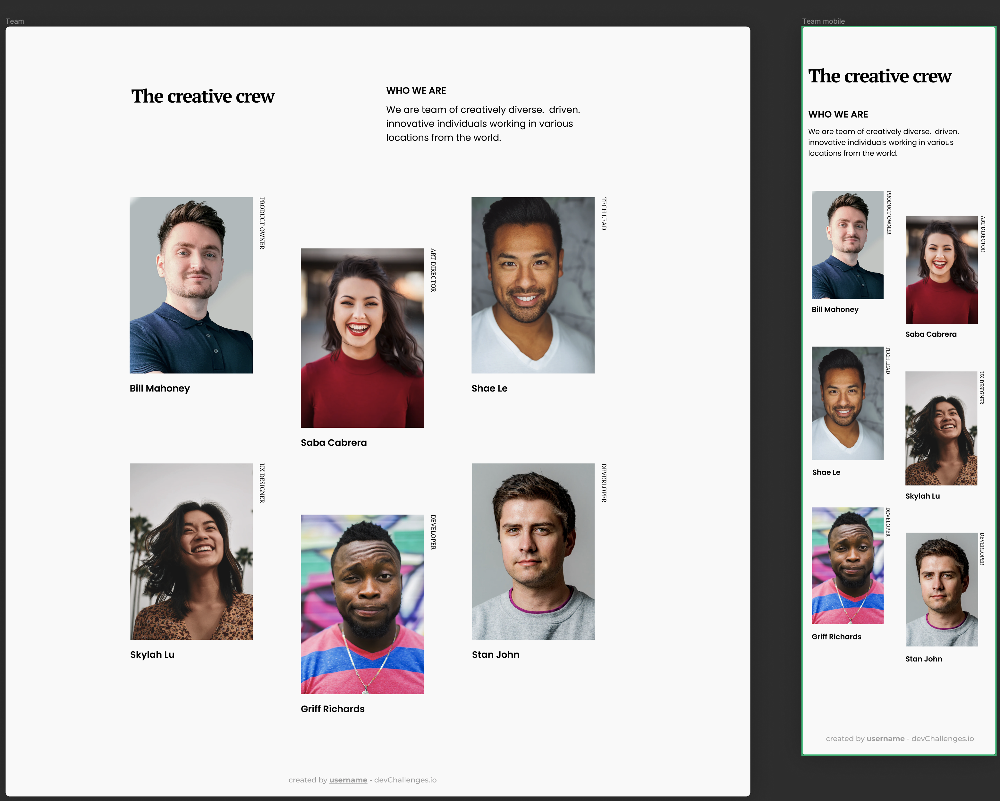
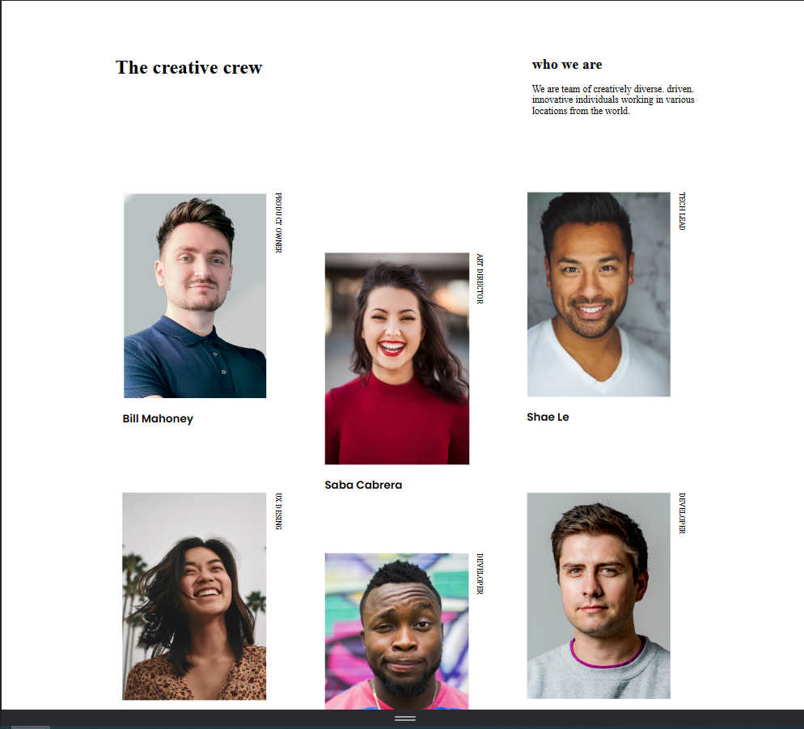
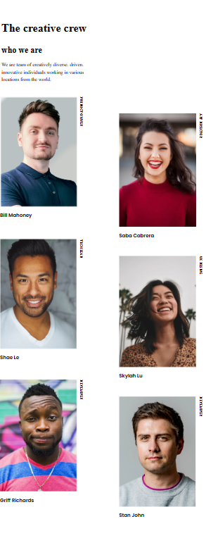

# Make It Real - MY TEAM PAGE

# Rick and Morty App 🚀

## Table of contents :page_facing_up:

- [Overview](#overview)
  - [Installation](#Installation)
  - [The challenge](#the-challenge)
  - [Screenshot](#screenshot)
- [My process](#my-process)
  - [Built with](#built-with)
  - [What I learned](#what-i-learned)
  - [Continued development](#continued-development)
- [Author](#author)

## Overview :writing_hand:

This project shows a responsive page to show your team

### Installation :gear:

To get started with the project, follow these steps:

1. Clone the repository:

```shell
git clone https://github.com/TatianaIng96/my-team-page.git
```

2. Navigate to the project directory:

```shell
cd my-team-page
```

3. Install the dependencies:

```shell
 npm install i
```

4. Start the application:
   Go to the file explorer of your pc, open the folder my-team-page and click on the index

The application will automatically open in your default web browser, ready for exploration.

### The Challenge :weight_lifting_man:

The challenge is to build a responsive page to show your team and make it look as close to the design as possible.



### Screenshot 📷

Here is a screenshot of the project's interface:

**_desktop view_**



**_mobile view_**



## My Process :mountain:

During this project, I gained valuable insights in the following areas:

Setup: I created the project using html and css. Set up the basic file structure.

- Requests: I added the photos I needed for the project in the assets folder
- Styling: I used css to style and create a visually appealing and responsive layout.
- Tests: I verified that everything that is shown on the page works on desktop and mobile.

### Built With :hammer_and_wrench:

The project was built using the following technologies:

- css
- html

### What I Learned :microscope:

Through this project, I gained a deeper understanding of:

- Creation of a responsive interface with css
- To visually organize images with css
- Use of css to improve the design process and maintainable CSS code.

### Continued Development :briefcase:

While the current version of the app is functional, there are several areas that can be improved:

- Make improvements to the styles to make it look more visually appealing

## Author :nerd_face:
Leidy Tatiana Cardona 
